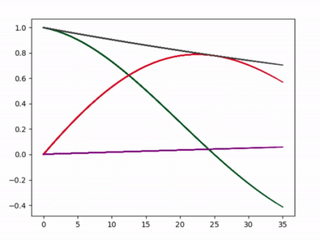
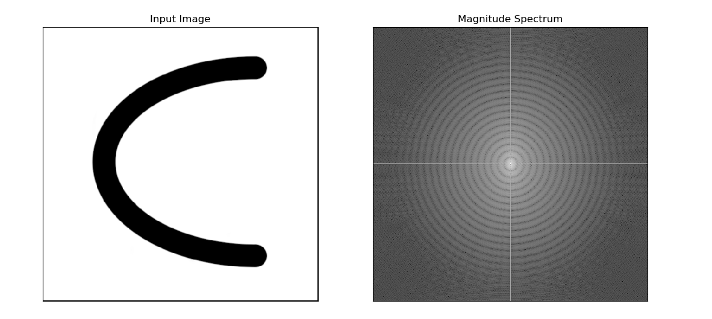
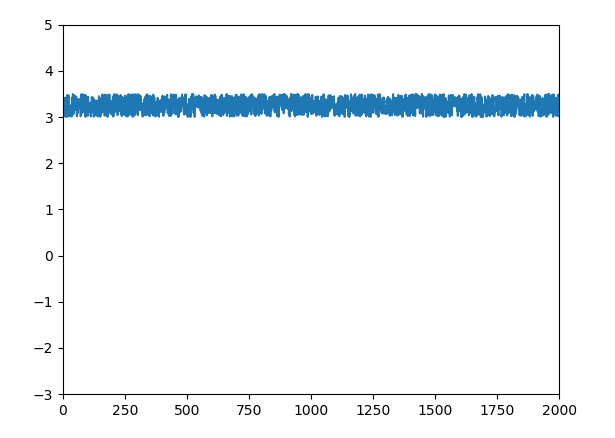

# **Bloch Equation Simulator**

                                    Team Members 
                    
                    Asmaa Mahmoud               SEC: 1 BN: 14
                    
                    Donia Abd El-Salam          SEC: 1 BN: 29
                    
                    Salma Hamza                 SEC: 1 BN: 38
                    
                    Mariam Ahmed                SEC: 2 BN: 29

---
## **Introduction**
----


Bloch simulation is the most accurate way to study the effect of a pulse sequence on magnetization. 

As we know , The deterioration of an NMR signal is analyzed in terms of two separate processes, each with 
their own time constants. One process, associated with T1 which effects the    [**longitudinal magnetization**](https://www.sciencedirect.com/topics/engineering/longitudinal-magnetization).

The other process, associated with T2 which affects the [**transverse 
magnetization**](https://www.sciencedirect.com/topics/engineering/longitudinal-magnetization).

Rotation about z axis happens simultaneously to the last two processes and this rotation called **Precession**.
_____

# **Code Details and Results** 

## The First part of the task .

we assumed that M  **"Megnitization Vector"**  is [0,0,1] and we rotate it around Y axsis to be [1,0,0] .

- ### We create function **zrot** to rotate the vector about z direction,and this function called by 

### **freeprecess** function which calculates A and B matrix .
#### freeprecess arguments:
- Relaxation times “T1” and “T2”
- The duration of free precession “dT” 
- The off-resonance frequency “df” 


```
        def zrot(phi):
        
            Rz = [[np.cos(phi) ,-np.sin(phi), 0],[np.sin(phi) ,np.cos(phi), 0],[ 0, 0 ,1]]
            return(Rz)

     
        def freeprecess(dT ,T1 ,T2 , df):
     
            phi = 2*np.pi*df*dT/1000
            E1 = np.exp(-dT/T1)	
            E2 = np.exp(-dT/T2)
        
            Afp = np.dot([[E2,0,0],[0,E2,0],[0,0,E1]],zrot(phi))
            
            Bfp = [0 ,0 ,1-E1]
        
            return(Afp,Bfp)

```


## **More Details about A and B Matrix**

 -  Mx(t)=Mx(0)exp(-t/T2)  , My(t)=My(0)exp(-t/T2) , Mz(t)= M0+[Mz(0)-M0]exp(-t/T1) , and M(t) = [Mx(t),My(t),Mz(t)]

    So to facilate the calcualtion M1 = A*M +B 

    where A is 3 x 3 matrix [[exp(-t/T2), 0 , 0],[ 0,exp(-t/T2),0],[ 0,0,exp(-t/T1)]] ,

    M = [ Mx(0), My(0), Mz(0)]  , B = [0,0,M0-exp(-t/T1)] and M0 =1 .


- Then we create **blockEquation** Function 

```    
    def blochEquation():

        
        A,B = freeprecess(dT,T1,T2,df)
    
        M = np.empty((N,3))
        
        M[0,:] =np.array([1,0,0])
        

        for k in range (N-1):

            M[k+1,:] = np.dot(A,M[k,:])+B
    

        pylab.subplot(111)

        DataX= M[:,0]
        DataY=M[:,1]
        DataZ = M[:,2]

        timeData = dT * np.arange(N)
        axes = pylab.gca()
    
        plot(axes,DataX,DataY,[],[])
        plot(axes,DataY,DataY,DataZ,timeData)
```

    


#### Firstly, it calls freeprecess to Calculate A and B matrix, Then calculate M at every time .

#### We create time array then go the plot function to plot .


```
    def plot(axes,DataX,DataY,DataZ,timeData):
    ydata=[]
    xdata=[]
    line, = axes.plot(xdata, ydata, 'r-')
    if (DataZ == []):
       
        axes.set_xlim(min(DataX)+0.5*min(DataX),max(DataX)+0.1*max(DataX))
        axes.set_ylim(min(DataY)+0.5*min(DataY),max(DataY)+0.1*max(DataY))
        for i in range(N):
            xdata.append(DataX[i])
            ydata.append(DataY[i])

            line.set_xdata(xdata)

            line.set_ydata(ydata)
            plt.draw()
            plt.pause(1e-17)
            time.sleep(0.001)
        plt.show()
    else:
        axes.set_xlim(0,1000)
        axes.set_ylim(-0.1,1)  
        for i in range(1,N):
            xdata.append(DataX[i-1])
            ydata.append(DataY[i-1])  
            zdata.append(DataZ[i])
            pylab.plot(timeData[:i],xdata,color = [0.9290, 0.6940, 0.1250],linewidth=1.5)
            pylab.plot(timeData[:i],ydata,color = [0.8500, 0.3250, 0.0980],linewidth=1.5)
            pylab.plot(timeData[:i],zdata,color = 'purple',linewidth=1.5)
            pylab.plot(timeData[:i],np.exp(-timeData[:i]/T2),color =[0.25, 0.25, 0.25],linewidth=1.5) 
            pylab.draw()
            pylab.pause(1e-117)
        
        plt.show()
    return

```

**Plot Function argument**

- axses used to get the current polar axes on the current figure. and we take it as argument to change the x and y range according to the data which we will plot.


- As know we have two 2D plot one between EX and EY , and the other plot between EX , EY and EZ with time.
so when we send DataZ and timeData that means that we will plot the exponential decay so we put the condition based on this .

*Precession of MXY component around Z axis*


where 
- X axis -> EX  
- Y axis -> EY

*Recovering of MZ component and decaying of MXY components with time*



where 
- in Y axsis
    - Read line -> EY 
    - purpule line -> EZ
    - green ->EX 
- X axsis 
    -Time 


---------
## Second part of the task.
___

We show image and FFT of the img

```

    def fourier():
        f = np.fft.fft2(img)
        fshift = np.fft.fftshift(f)
        magnitude_spectrum =np.abs(fshift)
        plt.subplot(121)
        plt.imshow(img, cmap='gray')
        plt.title('Input Image'), plt.xticks([]), plt.yticks([])
        plt.subplot(122)
        plt.imshow(magnitude_spectrum, cmap='gray')
        plt.title('Magnitude Spectrum'), plt.xticks([]), plt.yticks([])
        plt.show()
        return

```




--------------
## **Last part**
____
we create function generate a random B with range from 3 to 3.5 and z from 0 to 20 cm .

```

    def randomNums():
        seed(1)
        z = np.arange(0, 2000, 1) 
        B=[]
        for _ in range(0,200):

            B.append(random()*0.5+3)
        axes = pylab.gca()
        axes.set_xlim(0,200)
        axes.set_ylim(-3,5)
        plt.plot(z, B)
        plt.show()
        return
```



where

- y axis -> B in Tesla 
- x axis -> Z in mm

## **Hint:**
- Our code plot the graphs one by one. So, in order to see a graph, we have to wait for the previous graphs to be completly plotted.
- we change the N from N we used in gif cause we want it to be faster when you run the code.

